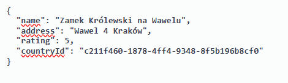

# CastlesToWatch Web API
This is simple Asp.net Web Api project

It includes two entities:

* Castle

* Country

Database design:

## Tech Stack

**Backend Technology** Asp.net Web Api

**Database** MSSQL

# Endpoints

## POST: Register User

Description : ***This post method register a new user. You have to provide username, password and role. At this moment there is only one role (Admin).***

URL

    https://localhost:7172/api/Auth/Register
        

Body:

Response:

## POST: Login User

Description : ***This post method log in a registered user. It returns a jwt key which should be used in header to perform some other http methods. Only GET: Countries and GET: Countries by id can be executed without jwt key***

URL

    https://localhost:7172/api/Auth/Login
        

Body:

Response:

## GET: Castles
Description : ***This get method returns list of castles with id, name address, rating and CountryId(which is foreign key to Country table). You can use filtering based on name and sorting based on rating (ascending or descending)***

URL

    https://localhost:7172/api/Castles
    https://localhost:7172/api/Castles?filterOn=name&filterQuery=zamek
    https://localhost:7172/api/Castles?sortBy=rating&isAscending=true
    https://localhost:7172/api/Castles?filterOn=name&filterQuery=zamek&sortBy=rating&isAscending=true
    
    
Parameters:

Response:

## GET: Castle by id

Description : ***This get method returns castle with given castle's id***

URL

    https://localhost:7172/api/Castles/d937bc61-4424-4147-57fe-08dc3b8bc37b
    
    
    
Parameters:

Response:

## POST: Castle
Description : ***This post method creates a new castle. You have to provide name, address, rating and CountryId from exisitng Countries table***

URL

    https://localhost:7172/api/Castles
    
    
    
Body:

Response:

## PUT: Castle

Description : ***This put method allows you with given castle's id to change name,address,rating or CountryId of castle***

URL

    https://localhost:7172/api/Castles/d28814d7-f906-4c26-e176-08dc3d1fca34
    
    
    
    
Parameters:

Body:

Response:

## DELETE: Castle
Description : ***This delete method allows you to delete castle from database with given castle's id***

URL

    https://localhost:7172/api/Castles/d28814d7-f906-4c26-e176-08dc3d1fca34
    
    
    
    
Parameters:

Response:

## GET: Countries
Description : ***This get method returns list of countries with id, name and shortname of each country***

URL

    https://localhost:7172/api/Countries
    
    
    
Response:

## GET: Country by id
Description : ***This get method returns country with given id***

URL

    https://localhost:7172/api/Countries/88a55b5d-84c1-48c4-a67a-6743ed9128ae
    
    
Parameters:

    
Response:

## POST: Country
Description : ***This post method creates a new country. You have to provide name and shortname of your country***

URL

    https://localhost:7172/api/Countries
    
    
Parameters:

    
Response:

